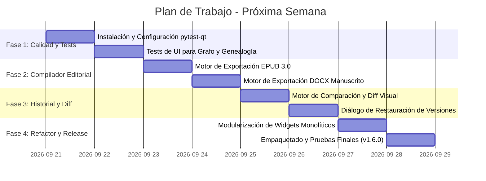

# Plan de Evolución y Blindaje Técnico — Aura Writer

Este plan técnico establece las metas, arquitectura y tareas detalladas para elevar **Aura Writer** al siguiente nivel de calidad y rendimiento durante la próxima semana.

---

## 🎯 Objetivos Principales

1. **Compilador Editorial Profesional**: Permitir la exportación directa a `.epub` (estándar EPUB 3 con CSS tipográfico) y `.docx` (formato estándar de manuscrito editorial: Shunn/Courier/Times, doble espacio y foliado).
2. **Historial de Versiones & Diff Visual de Capítulos**: Poder comparar versiones anteriores de un capítulo y ver en rojo/verde las adiciones y eliminaciones de texto en tiempo real.
3. **Blindaje de Calidad con Tests de UI (`pytest-qt`)**: Automatizar pruebas de clics, navegación por grafos, árboles genealógicos y diálogos para eliminar cualquier posibilidad de errores en tiempo de ejecución.
4. **Modularización Arquitectónica**: Desacoplar vistas gigantes en subcontroladores especializados para facilitar la mantenibilidad.

---

## 📅 Calendario de Ejecución

---

## 🛠️ Detalle de Tareas Técnicas

### 1. Fase 1: Tests Automatizados de UI (`pytest-qt`)
- **Problema actual**: Las pruebas solo cubren backend y lógica criptográfica/modelos.
- **Implementación**:
  - Crear `tests/ui/test_relation_graph.py`: probar clics de nodos, conmutación de aristas, cálculo de flechas.
  - Crear `tests/ui/test_genealogy.py`: probar carga de 20 generaciones y mezclas de 3 linajes sin excepciones.
  - Crear `tests/ui/test_editor.py`: probar apertura de capítulos, guardado automático y modo focus.

### 2. Fase 2: Compilador Editorial (EPUB 3 & DOCX)
- **Archivos nuevos**:
  - `src/exporters/epub_exporter.py`: generación de archivo EPUB válido según IDPF/W3C con metadatos de obra, portada y tipografía legible.
  - `src/exporters/docx_exporter.py`: generación de documento `.docx` con formato de manuscrito profesional (sangría de primera línea francesa/estándar, sin saltos dobles accidentales, encabezados de página).
  - `src/ui/export_dialog.py`: interfaz moderna para elegir fuentes, márgenes, capítulos a incluir y notas al pie.

### 3. Fase 3: Historial de Cambios y Diff Visual de Capítulos
- **Archivos a modificar / crear**:
  - `src/core/diff_engine.py`: integración de `difflib` para generar HTML con marcas `<ins>` (verde) y `<del>` (rojo).
  - `src/ui/history_diff_dialog.py`: vista comparativa a doble columna (o inline) para inspeccionar qué cambió entre dos guardados y botón "Restaurar este párrafo/versión".

### 4. Fase 4: Refactorización y Modularización
- Extraer de `src/ui/genealogy_widget.py` el motor matemático de layouts a `src/ui/genealogy/layout_engine.py`.
- Extraer de `src/ui/main_window.py` los manejadores de menú y atajos a controladores dedicados.

---

## 🚀 Criterios de Éxito para la Versión 1.6.0
1. Cobertura de tests superior al **85%** con tests de UI incluidos.
2. Un autor puede exportar un libro de 80,000 palabras a `.epub` y `.docx` listo para imprenta o Amazon KDP en menos de 3 segundos.
3. El editor permite viajar en el tiempo a cualquier revisión anterior de un capítulo y ver el diff exacto.
